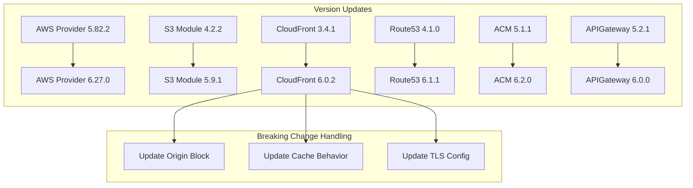

# Design Document

## Overview

This design details the implementation approach for upgrading Terraform infrastructure to latest compatible versions while maintaining backward compatibility and minimizing disruption. The upgrade follows a staged approach: provider first, then modules, then improvements.

## Architecture

The existing architecture remains unchanged. This upgrade focuses on:

1. Version updates to providers and modules
2. Interface adaptations for breaking changes
3. Security hardening
4. Documentation improvements



## Components and Interfaces

### terraform.tf Changes

Update version constraints:

```hcl
terraform {
  required_version = ">= 1.10.0"

  required_providers {
    aws = {
      source  = "hashicorp/aws"
      version = "~> 6.27"
    }
  }
}
```

### S3 Bucket Module Changes

The S3 bucket module interface is compatible. Update version:

```hcl
########################################################################################################################
# S3 Bucket - Contains website client files and setup as a static website
# See https://docs.aws.amazon.com/AmazonS3/latest/userguide/WebsiteAccessPermissionsReqd.html#bucket-policy-static-site
########################################################################################################################

module "client_files_s3_bucket" {
  source  = "terraform-aws-modules/s3-bucket/aws"
  version = "5.9.1"
  # ... rest unchanged
}
```

### CloudFront Module Changes (Breaking)

The CloudFront module v6.0 has significant interface changes. Here's the migration:

**Current (v3.4.1):**

```hcl
origin = {
  s3_website_endpoint = {
    domain_name = module.client_files_s3_bucket.s3_bucket_website_endpoint
    custom_origin_config = {
      http_port              = 80
      https_port             = 443
      origin_protocol_policy = "http-only"
      origin_ssl_protocols   = ["TLSv1", "TLSv1.1", "TLSv1.2", "SSLv3"]
    }
  }
}

default_cache_behavior = {
  target_origin_id       = "s3_website_endpoint"
  viewer_protocol_policy = "redirect-to-https"
  allowed_methods        = ["GET", "HEAD"]
  cached_methods         = ["GET", "HEAD"]
  compress               = true
  query_string           = true
  use_forwarded_values   = false
  cache_policy_name          = "Managed-CachingOptimized"
  origin_request_policy_name = "Managed-CORS-CustomOrigin"
}

viewer_certificate = {
  acm_certificate_arn = module.acm_certificate.acm_certificate_arn
  minimum_protocol_version : "TLSv1.2_2021"
  ssl_support_method : "sni-only"
}
```

**New (v6.0.2):**

```hcl
#############################################################################################################
# CloudFront Distribution - for more effective website hosting
# Based on https://docs.aws.amazon.com/AmazonS3/latest/userguide/website-hosting-cloudfront-walkthrough.html
#############################################################################################################

module "cloudfront" {
  source  = "terraform-aws-modules/cloudfront/aws"
  version = "6.0.2"

  # ... existing config preserved ...

  origin = {
    s3_website_endpoint = {
      domain_name = module.client_files_s3_bucket.s3_bucket_website_endpoint
      custom_origin_config = {
        http_port              = 80
        https_port             = 443
        origin_protocol_policy = "http-only"
        # Only TLSv1.2 is considered secure for origin connections
        origin_ssl_protocols   = ["TLSv1.2"]
      }
    }
  }

  default_cache_behavior = {
    target_origin_id       = "s3_website_endpoint"
    viewer_protocol_policy = "redirect-to-https"
    allowed_methods        = ["GET", "HEAD"]
    cached_methods         = ["GET", "HEAD"]
    compress               = true
    # Cache behavior controlled by managed cache policies
    cache_policy_name          = "Managed-CachingOptimized"
    origin_request_policy_name = "Managed-CORS-CustomOrigin"
  }

  viewer_certificate = {
    acm_certificate_arn      = module.acm_certificate.acm_certificate_arn
    minimum_protocol_version = "TLSv1.2_2021"
    ssl_support_method       = "sni-only"
  }

  # ... rest of config preserved ...
}
```

### Route53 Module Changes

Update version, interface compatible:

```hcl
############################################
# Route53 DNS Zone - Enables DNS for domain
############################################

module "route53_zone" {
  source  = "terraform-aws-modules/route53/aws//modules/zones"
  version = "6.1.1"
  # ... rest unchanged
}

# Point our domain to the cloudfront distribution in Route53
module "cloudfront_route53_record" {
  source  = "terraform-aws-modules/route53/aws//modules/records"
  version = "6.1.1"
  # ... rest unchanged
}
```

### ACM Module Changes

Update version, interface compatible:

```hcl
####################################################################
# ACM SSL/TLS Certificate - Used by project's networking components
####################################################################

module "acm_certificate" {
  source  = "terraform-aws-modules/acm/aws"
  version = "6.2.0"
  # ... rest unchanged
}
```

### API Gateway Module Changes

Update version, interface compatible:

```hcl
####################################################
# API Gateway - Connects Client to Lambda Functions
# Routes & Integrations added in other modules
####################################################

module "api_gateway" {
  source  = "terraform-aws-modules/apigateway-v2/aws"
  version = "6.0.0"
  # ... rest unchanged
}
```

## Data Models

### New Outputs Structure

```hcl
output "client_files_s3_bucket_name" {
  value       = module.client_files_s3_bucket.s3_bucket_id
  description = "Name of the S3 bucket hosting the website's client files"
}

output "cloudfront_distribution_id" {
  value       = module.cloudfront.cloudfront_distribution_id
  description = "CloudFront distribution ID for cache invalidation"
}

output "cloudfront_distribution_domain_name" {
  value       = module.cloudfront.cloudfront_distribution_domain_name
  description = "CloudFront distribution domain name"
}

output "api_gateway_endpoint" {
  value       = module.api_gateway.api_endpoint
  description = "API Gateway endpoint URL"
}

output "route53_zone_nameservers" {
  value       = module.route53_zone.route53_zone_name_servers[var.domain_name]
  description = "Route53 zone nameservers for DNS delegation"
}
```

### Variable Validation

```hcl
variable "region" {
  description = "AWS Region to use for this account"
  type        = string
  default     = "us-east-1"

  validation {
    condition     = can(regex("^[a-z]{2}-[a-z]+-[0-9]$", var.region))
    error_message = "Region must be a valid AWS region format (e.g., us-east-1)."
  }
}

variable "domain_name" {
  description = "Domain name for the website"
  type        = string

  validation {
    condition     = can(regex("^[a-z0-9][a-z0-9-]*\\.[a-z]{2,}$", var.domain_name))
    error_message = "Domain name must be a valid domain format."
  }
}

variable "api_domain_prefix" {
  description = "Prefix used for the api services domain"
  type        = string
  default     = "api"

  validation {
    condition     = can(regex("^[a-z0-9][a-z0-9-]*$", var.api_domain_prefix))
    error_message = "API domain prefix must contain only lowercase letters, numbers, and hyphens."
  }
}
```

## Correctness Properties

_A property is a characteristic or behavior that should hold true across all valid executions of a system-essentially, a formal statement about what the system should do. Properties serve as the bridge between human-readable specifications and machine-verifiable correctness guarantees._

### Property 1: Version Constraint Satisfaction

_For any_ Terraform configuration after upgrade, running `terraform init` SHALL succeed without version constraint errors
**Validates: Requirements 1.1, 2.1, 3.1, 4.1, 5.1, 6.1, 7.1**

### Property 2: Configuration Validity

_For any_ Terraform configuration after upgrade, running `terraform validate` SHALL return success with no errors
**Validates: Requirements 1.2, 3.2, 4.2, 6.2, 7.2**

### Property 3: Plan Stability

_For any_ existing infrastructure, running `terraform plan` after upgrade SHALL NOT show unexpected resource replacements for S3 bucket, Route53 zone, or ACM certificate
**Validates: Requirements 12.2, 12.3**

### Property 4: Security Protocol Compliance

_For any_ CloudFront origin configuration, the origin_ssl_protocols SHALL NOT contain deprecated protocols (TLSv1, TLSv1.1, SSLv3)
**Validates: Requirements 8.1, 8.3**

### Property 5: Output Completeness

_For any_ successful terraform apply, all required outputs (CloudFront ID, API Gateway URL, nameservers) SHALL be populated with non-empty values
**Validates: Requirements 9.1, 9.2, 9.3, 9.4**

### Property 6: Variable Validation

_For any_ invalid input to validated variables (region, domain_name, api_domain_prefix), terraform plan SHALL fail with a descriptive error message
**Validates: Requirements 10.1, 10.2, 10.3**

### Property 7: Comment Preservation

_For any_ Terraform file after upgrade, all existing section header comments (########) SHALL be preserved
**Validates: Requirements 13.1, 13.2**

## Error Handling

### Upgrade Rollback Strategy

If issues are encountered during upgrade:

1. **terraform init failure**: Revert version constraints in terraform.tf
2. **terraform validate failure**: Check module interface changes, consult migration notes
3. **terraform plan shows replacements**:
   - For CloudFront: Expected due to interface changes, verify aliases preserved
   - For S3: Unexpected - investigate and potentially use `terraform state mv`
   - For Route53: Unexpected - investigate zone_id preservation
4. **terraform apply failure**: Use `terraform state list` to identify partial state, manual cleanup may be needed

### Known Issues and Mitigations

| Issue                               | Mitigation                                                         |
| ----------------------------------- | ------------------------------------------------------------------ |
| CloudFront distribution replacement | May occur due to interface changes; aliases and SSL cert preserved |
| State drift after provider upgrade  | Run `terraform refresh` before plan                                |
| Module output name changes          | Verify output references in dependent configurations               |

## Testing Strategy

### Unit Tests

- Terraform configuration validation (`terraform validate`)
- Variable validation testing with invalid inputs
- Output value verification

### Property-Based Tests

- Version constraint satisfaction across module combinations
- Security protocol compliance verification
- Plan stability testing against mock state

### Integration Tests

- Full `terraform init` → `validate` → `plan` cycle
- Output value population verification
- Cross-module reference validation

Each property test will run a minimum of 100 iterations to ensure comprehensive coverage. Tests will be tagged with format: **Feature: terraform-upgrade-improvements, Property {number}: {property_text}**

### Manual Validation Checkpoints

1. After version updates: Review `terraform plan` output
2. After CloudFront changes: Verify distribution configuration
3. After security updates: Confirm TLS protocols
4. Before apply: Full review of planned changes
